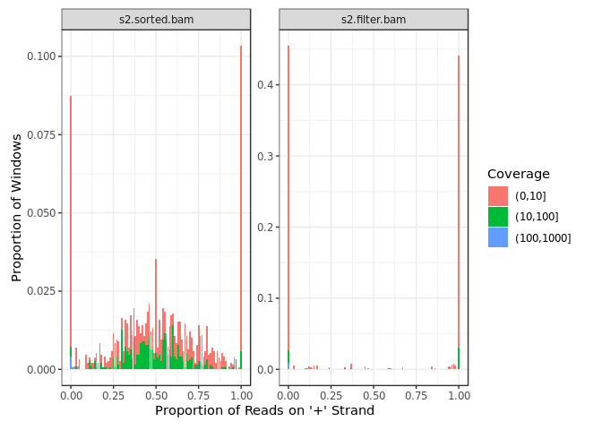

strandCheckR
============

This package aims to check the strandeness of the reads in a bam file.
It can be applied to quantify and remove putative double strand DNA from
a strand-specific RNA sample. The package uses a sliding window to scan
a bam file to get the number of positive/negative reads in each window.
It then provides method to plot the positive/negative proportions of all
sliding windows, which allow users to have an idea about how much the
sample was contaminated and the appropriate threshold to be used for
filtering. Finally, the users can filter putative DNA contamination from
their strand-specific RNA sample using their selected threshold.

Installation
============

To install the release version on Bioconductor:

    if (!requireNamespace("BiocManager", quietly=TRUE))
        install.packages("BiocManager")
    BiocManager::install('strandCheckR')

To install the development version on github:

    devtools::install_github('UofABioinformaticsHub/strandCheckR', 
                             build_vignettes = TRUE)

Usage
=====

Following are some main functions of the package.

-   getWinFromBamFile

To get the number of positive/negative reads of all sliding windows from
a bam file:

    library(strandCheckR)
    files <- system.file(
        "extdata",c("s1.sorted.bam","s2.sorted.bam"),package = "strandCheckR"
        )
    win <- getWinFromBamFile(files, sequences = "10")
    # shorten the file name
    win$File <- basename(as.character(win$File))
    win

    ## DataFrame with 3078 rows and 10 columns
    ##       Type   Seq     Start       End NbPos NbNeg CovPos CovNeg MaxCoverage
    ##      <Rle> <Rle> <numeric> <numeric> <Rle> <Rle>  <Rle>  <Rle>       <Rle>
    ## 1       SE    10   7696701   7697700     0    17      0    393          17
    ## 2       SE    10   7696801   7697800     0    17      0    393          17
    ## 3       SE    10   7696901   7697900     0    17      0    393          17
    ## 4       SE    10   7697001   7698000     0    17      0    393          17
    ## 5       SE    10   7697101   7698100     0    17      0    393          17
    ## ...    ...   ...       ...       ...   ...   ...    ...    ...         ...
    ## 3074    SE    10   7398501   7399500    46    34   2241   1668          13
    ## 3075    SE    10   7398601   7399600    46    34   2241   1668          13
    ## 3076    SE    10   7398701   7399700    41    32   2046   1568          13
    ## 3077    SE    10   7398801   7399800    48    31   2500   1681          25
    ## 3078    SE    10   7398901   7399900    52    35   2581   1728          25
    ##               File
    ##        <character>
    ## 1    s1.sorted.bam
    ## 2    s1.sorted.bam
    ## 3    s1.sorted.bam
    ## 4    s1.sorted.bam
    ## 5    s1.sorted.bam
    ## ...            ...
    ## 3074 s2.sorted.bam
    ## 3075 s2.sorted.bam
    ## 3076 s2.sorted.bam
    ## 3077 s2.sorted.bam
    ## 3078 s2.sorted.bam

-   plotHist

The histogram plot shows you the proportion of positive/negative reads
across all windows.

    plotHist(
        windows = win, group_by = c("File","OverlapTranscript"), 
        normalize_by = "File", scales = "free_y"
        )

In this example, file *s2.sorted.bam* seems to be contaminated with
double strand DNA, while file *s1.sorted.bam* is cleaner.

-   plotWin

The win plot presents each window by a point. The plot also has
threshold lines that can be used to give guidance as to the best
threshold to choose when filtering windows. Given a threshold, a
positive (resp. negative) window is kept if and only if it is above
(resp. below) the corresponding threshold line.

    plotWin(win, group_by = "File")

-   filterDNA

The functions *filterDNA* removes potential double strand DNA from a bam
file using a selected threshold.

    win2 <- filterDNA(
        file = files[2], sequences = "10", destination = "s2.filter.bam", 
        threshold = 0.7, getWin = TRUE
        )

Comparing the histogram plot of the file before and after filtering:

    win2$File <- basename(as.character(win2$File))
    win2$File <- factor(win2$File,levels = c("s2.sorted.bam","s2.filter.bam"))
    library(ggplot2)
    plotHist(win2,group_by = "File",normalize_by = "File",scales = "free_y") 

