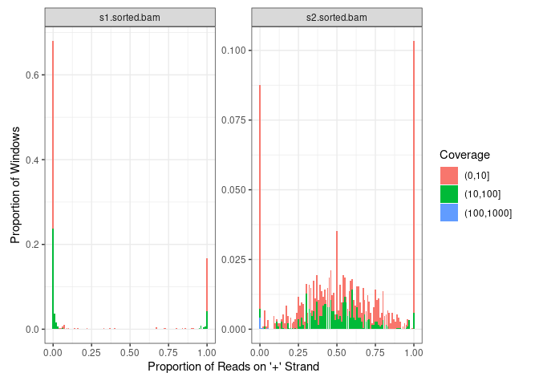
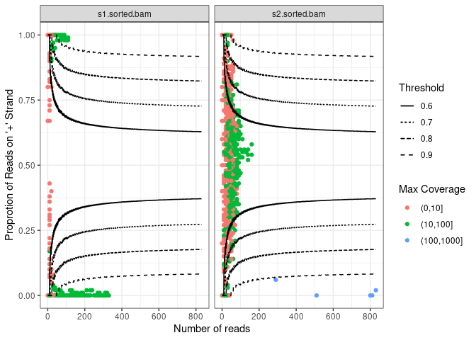
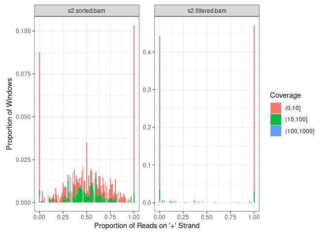

<!-- README.md is generated from README.Rmd. Please edit the Rmd file only -->

[](https://travis-ci.org/UofABioinformaticsHub/strandCheckR)
[](http://www.repostatus.org/#active)
[](https://zenodo.org/badge/latestdoi/70646093)

## strandCheckR

This package aims to check the strandedness of reads in a bam file,
enabling easy detection of any contaminating genomic DNA or other
unexpected sources of contamination. It can be applied to quantify and
remove reads which correspond to putative double strand DNA within a
strand-specific RNA sample. The package uses a sliding window to scan a
bam file and find the number of positive/negative reads in each window.
It then provides method to plot the proportions of positive/negative
stranded alignments within all windows, which allow users to determine
how much the sample was contaminated, and to determine an appropriate
threshold for filtering. Finally, users can filter putative DNA
contamination from any strand-specific RNAseq sample using their
selected threshold.

## Installation

To install the release version from Bioconductor:

``` r
install.packages("BiocManager")
BiocManager::install("strandCheckR")
```

To install the development version on github (i.e. this version):

``` r
install.packages("BiocManager")
BiocManager::install("UofABioinformaticsHub/strandCheckR")
```

## Quick Usage Guide

Following are the main functions of the package.

- `getStrandFromBamFile()`

To get the number of +/- stranded reads of all sliding windows across a
bam file:

``` r
# Load the package and example bam files
library(strandCheckR)
files <- system.file(
    "extdata", c("s1.sorted.bam", "s2.sorted.bam"),
    package = "strandCheckR"
)

# Find the read proportions from chromosome 10 for the two files
win <- getStrandFromBamFile(files, sequences = "10")

# Tidy up the file name for prettier output
win$File <- basename(as.character(win$File))
win
## DataFrame with 3078 rows and 10 columns
##       Type   Seq     Start       End NbPos NbNeg CovPos CovNeg MaxCoverage
##      <Rle> <Rle> <numeric> <numeric> <Rle> <Rle>  <Rle>  <Rle>       <Rle>
## 1       SE    10   7696701   7697700     0    17      0    393          17
## 2       SE    10   7696801   7697800     0    17      0    393          17
## 3       SE    10   7696901   7697900     0    17      0    393          17
## 4       SE    10   7697001   7698000     0    17      0    393          17
## 5       SE    10   7697101   7698100     0    17      0    393          17
## ...    ...   ...       ...       ...   ...   ...    ...    ...         ...
## 3074    SE    10   7398501   7399500    46    34   2241   1668          13
## 3075    SE    10   7398601   7399600    46    34   2241   1668          13
## 3076    SE    10   7398701   7399700    41    32   2046   1568          13
## 3077    SE    10   7398801   7399800    48    31   2500   1681          25
## 3078    SE    10   7398901   7399900    52    35   2581   1728          25
##               File
##        <character>
## 1    s1.sorted.bam
## 2    s1.sorted.bam
## 3    s1.sorted.bam
## 4    s1.sorted.bam
## 5    s1.sorted.bam
## ...            ...
## 3074 s2.sorted.bam
## 3075 s2.sorted.bam
## 3076 s2.sorted.bam
## 3077 s2.sorted.bam
## 3078 s2.sorted.bam
```

- `plotHist()`

The histogram plot shows you the proportion of +/- stranded reads across
all windows.

``` r
plotHist(
        windows = win, 
        groupBy = "File", 
        normalizeBy = "File", 
        scales = "free_y"
        )
```

<!-- -->

In this example, *s2.sorted.bam* seems to be contaminated with double
stranded DNA, as evidenced by many windows containing a roughly equal
proportion of reads on both strands, whilst *s1.sorted.bam* is cleaner.

- `plotWin()`

The output from `plotWin()` represents each window as a point. This plot
also has threshold lines which can be used to provide guidance as to the
best threshold to choose when filtering windows. Given a suitable
threshold, reads from a positive (resp. negative) window are kept if and
only if the proportion is above (resp. below) the corresponding
threshold line.

``` r
plotWin(win, groupBy = "File")
```

<!-- -->

- `filterDNA()`

The function `filterDNA()` removes potential double stranded DNA from a
bam file using a selected threshold.

``` r
win2 <- filterDNA(
    file = files[2], 
    destination = "s2.filtered.bam", 
    sequences = "10", 
    threshold = 0.7, 
    getWin = TRUE
)
```

Comparing the histogram plot of the file before and after filtering
shows that reads from the windows with roughly equal proportions of +/-
stranded reads have been removed.

``` r
win2$File <- basename(as.character(win2$File))
win2$File <- factor(win2$File, levels = c("s2.sorted.bam", "s2.filtered.bam"))
library(ggplot2)
plotHist(win2, groupBy = "File", normalizeBy = "File", scales = "free_y") 
```

<!-- -->

A more comprehensive vignette is available at
<https://bioconductor.org/packages/release/bioc/vignettes/strandCheckR/inst/doc/strandCheckR.html>

## Support

We recommend that questions seeking support in using the software are
posted to the Bioconductor support forum -
<https://support.bioconductor.org/> - where they will attract not only
our attention but that of the wider Bioconductor community.

Code contributions, bug reports and feature requests are most welcome.
Please make any pull requests against the master branch at
<https://github.com/UofABioinformaticsHub/strandCheckR> and file issues
at <https://github.com/UofABioinformaticsHub/strandCheckR/issues>

## Author Contributions

- *Thu-Hien To* authored the vast majority of code within the package
  along with unit tests
- *Thu-Hien To* and *Stevie Pederson* worked closely together on the
  package design and methodology

## License

`strandCheckR` is licensed under [GPL \>=
2.0](https://www.r-project.org/Licenses/GPL-2)

## Session Info

    ## R version 4.4.0 (2024-04-24)
    ## Platform: x86_64-pc-linux-gnu
    ## Running under: Ubuntu 20.04.6 LTS
    ## 
    ## Matrix products: default
    ## BLAS:   /usr/lib/x86_64-linux-gnu/openblas-pthread/libblas.so.3 
    ## LAPACK: /usr/lib/x86_64-linux-gnu/openblas-pthread/liblapack.so.3;  LAPACK version 3.9.0
    ## 
    ## locale:
    ##  [1] LC_CTYPE=en_AU.UTF-8       LC_NUMERIC=C              
    ##  [3] LC_TIME=en_AU.UTF-8        LC_COLLATE=en_AU.UTF-8    
    ##  [5] LC_MONETARY=en_AU.UTF-8    LC_MESSAGES=en_AU.UTF-8   
    ##  [7] LC_PAPER=en_AU.UTF-8       LC_NAME=C                 
    ##  [9] LC_ADDRESS=C               LC_TELEPHONE=C            
    ## [11] LC_MEASUREMENT=en_AU.UTF-8 LC_IDENTIFICATION=C       
    ## 
    ## time zone: Australia/Adelaide
    ## tzcode source: system (glibc)
    ## 
    ## attached base packages:
    ## [1] stats4    stats     graphics  grDevices utils     datasets  methods  
    ## [8] base     
    ## 
    ## other attached packages:
    ##  [1] strandCheckR_1.25.1  Rsamtools_2.22.0     Biostrings_2.74.1   
    ##  [4] XVector_0.46.0       GenomicRanges_1.58.0 GenomeInfoDb_1.42.1 
    ##  [7] IRanges_2.40.1       S4Vectors_0.44.0     BiocGenerics_0.52.0 
    ## [10] ggplot2_3.5.1       
    ## 
    ## loaded via a namespace (and not attached):
    ##  [1] tidyselect_1.2.1                        
    ##  [2] dplyr_1.1.4                             
    ##  [3] farver_2.1.2                            
    ##  [4] blob_1.2.4                              
    ##  [5] bitops_1.0-9                            
    ##  [6] fastmap_1.2.0                           
    ##  [7] RCurl_1.98-1.16                         
    ##  [8] GenomicAlignments_1.42.0                
    ##  [9] XML_3.99-0.18                           
    ## [10] digest_0.6.37                           
    ## [11] lifecycle_1.0.4                         
    ## [12] KEGGREST_1.46.0                         
    ## [13] TxDb.Hsapiens.UCSC.hg38.knownGene_3.20.0
    ## [14] RSQLite_2.3.9                           
    ## [15] magrittr_2.0.3                          
    ## [16] compiler_4.4.0                          
    ## [17] rlang_1.1.4                             
    ## [18] tools_4.4.0                             
    ## [19] yaml_2.3.10                             
    ## [20] rtracklayer_1.66.0                      
    ## [21] knitr_1.49                              
    ## [22] S4Arrays_1.6.0                          
    ## [23] labeling_0.4.3                          
    ## [24] bit_4.5.0.1                             
    ## [25] curl_6.1.0                              
    ## [26] DelayedArray_0.32.0                     
    ## [27] plyr_1.8.9                              
    ## [28] abind_1.4-8                             
    ## [29] BiocParallel_1.40.0                     
    ## [30] withr_3.0.2                             
    ## [31] grid_4.4.0                              
    ## [32] colorspace_2.1-1                        
    ## [33] scales_1.3.0                            
    ## [34] SummarizedExperiment_1.36.0             
    ## [35] cli_3.6.3                               
    ## [36] rmarkdown_2.29                          
    ## [37] crayon_1.5.3                            
    ## [38] generics_0.1.3                          
    ## [39] rstudioapi_0.17.1                       
    ## [40] httr_1.4.7                              
    ## [41] reshape2_1.4.4                          
    ## [42] rjson_0.2.23                            
    ## [43] DBI_1.2.3                               
    ## [44] cachem_1.1.0                            
    ## [45] stringr_1.5.1                           
    ## [46] zlibbioc_1.52.0                         
    ## [47] parallel_4.4.0                          
    ## [48] AnnotationDbi_1.68.0                    
    ## [49] restfulr_0.0.15                         
    ## [50] matrixStats_1.5.0                       
    ## [51] vctrs_0.6.5                             
    ## [52] Matrix_1.7-1                            
    ## [53] jsonlite_1.8.9                          
    ## [54] bit64_4.5.2                             
    ## [55] GenomicFeatures_1.58.0                  
    ## [56] glue_1.8.0                              
    ## [57] codetools_0.2-20                        
    ## [58] stringi_1.8.4                           
    ## [59] gtable_0.3.6                            
    ## [60] BiocIO_1.16.0                           
    ## [61] UCSC.utils_1.2.0                        
    ## [62] munsell_0.5.1                           
    ## [63] tibble_3.2.1                            
    ## [64] pillar_1.10.1                           
    ## [65] htmltools_0.5.8.1                       
    ## [66] GenomeInfoDbData_1.2.13                 
    ## [67] R6_2.5.1                                
    ## [68] evaluate_1.0.3                          
    ## [69] Biobase_2.66.0                          
    ## [70] lattice_0.22-6                          
    ## [71] png_0.1-8                               
    ## [72] memoise_2.0.1                           
    ## [73] Rcpp_1.0.13-1                           
    ## [74] gridExtra_2.3                           
    ## [75] SparseArray_1.6.0                       
    ## [76] xfun_0.50                               
    ## [77] MatrixGenerics_1.18.0                   
    ## [78] pkgconfig_2.0.3
