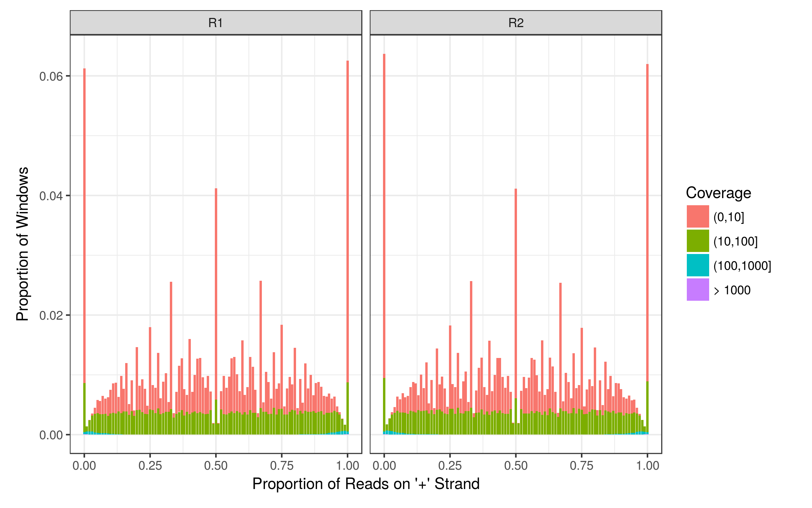
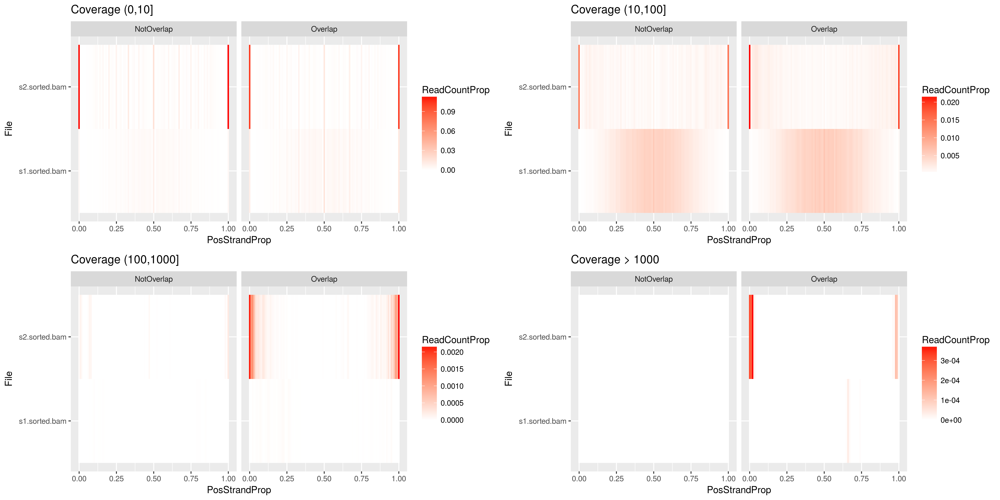

# Introduction

*strandCheckR* is a package used to quantify and remove contamination from genomic DNA within a stranded RNA-seq experiment.
It takes  one  bam file as input and uses a sliding window across each chromosome to assess whether the window contains reads mainly from one strand, as would be expected from RNA molecules, or from both strands as would be expected from contaminating DNA.
For each window, it considers the proportion of +/- stranded reads comparing to a given threshold, to decide if a window contains reads derived from single strand RNA or double stranded DNA.
Then each read fragment is assigned to a probability of being kept or not, based on the proportion of +/- stranded of the windows that contain that fragment.

# Get windows information

The function *getWinFromBamFile* can be used to get the number of +/- stranded reads from all sliding windows throughout a list of bam files.
The bam files should be sorted and have their index files located at the same path as well.


```{r getWin, eval=FALSE}
library(strandCheckR)
files <- system.file("extdata",c("s1.sorted.bam","s2.sorted.bam"),package = "strandCheckR")
win <- getWinFromBamFile(files)
win$File <- basename(win$File)
```

# Intersect with an annotation GRanges object

If you have an annotation data, you can integrate it with the sliding windows obtained from the previous step using the function *intersectWithFeature*. The annotation must be a GRanges object, with or without mcols.
Make sure that the chromosome names in windows and annotation data are consistent.
By default, you will have an additional column in the windows dataframe which indicates wheather a window overlap with any feature in the annotation object. You can also get details of the overlapped features in the mcols of the annotation object by setting *getFeatureInfo=TRUE* and specifying which mcols you'd like to extract details in *mcolsAnnnot* parameter.

```{r intersect, eval=FALSE}
library(TxDb.Hsapiens.UCSC.hg38.knownGene)
annot <- transcripts(TxDb.Hsapiens.UCSC.hg38.knownGene)
win$Chr <- paste0("chr",win$Chr) #add chr before the chromosome names to be consistent with the annot data
win <- intersectWithFeature(windows = win,annotation = annot,overlapCol = "OverlapFeature")
```

# Plot histogram and windows information

With these windows, you can have some plots via *plotHist* and *plotWin* functions which can be saved to an appropriate location.

To plot the histogram of positive proportion of the sliding windows, we need to summarize them first using *summarizeHist*. This function creates a histogram on the frequency of positive proportion over all windows, and also to group/normalize them based on given column names. The obtained dataframe can be used to plot the histogram using function *plotHist*. The plot gives you an idea on how much double-strand DNA is contained in your sample. In perfectly clear ss-RNA-seq, the positive proportion of every window should be either around 0\% or 100\%. The more amount of windows have this proportion around 50\%, the more the sample was contaminated by DNA. 

```{r plotHist, eval=FALSE}
hist <- summarizeHist(windows = win,group_by = c("File","OverlapFeature"), normalize_by = "File")
plotHist(hist, facets = c("File","OverlapFeature"), save=TRUE,file="hist.png",width=10,height=7)
```



Heatmap can be used instead of classic barplot for histogram when specifying *heatmap=TRUE*. It would be usefull to visualize mutliple files in the same plot.

```{r heatMap,eval=FALSE}
plotHist(hist, facets = c("OverlapFeature"), heatmap = TRUE, save=TRUE,file="histHeat.png",width=16,height=8)
```



*plotWin* creates a plot on the number of reads vs positive proportion of each window. There are also 4 lines correspond to 4 representative thresholds (0.6, 0.7, 0.8, 0.9). Threshold is a parameter that is used when filtering a bam file using *filterDNA*.
Given a threshold, a positive (resp. negative) window is kept if and only if it is above (resp. below) the corresponding threshold line on this plot. This plot would suggest which threshold to be used for filtering DNA from your sample.

```{r plotwin,eval=FALSE}
plotWin(win, facets = c("File","OverlapFeature"), save=TRUE,file="win.png",width=10,height=7)
```


# Filter bam files

The functions *filterDNA* removes potential double strand DNA from a bam file using a given threshold.

```{r filteDNA, eval=FALSE}
filterDNA(file = files[1], destination = "s1.filter.bam", threshold = 0.7)
```

Other parameters can be specified for more flexible filtering: define the ranges that you want to always keep, the minimum number of reads under which you want to ignore, the pvalue threshold for keeping a windows etc.
